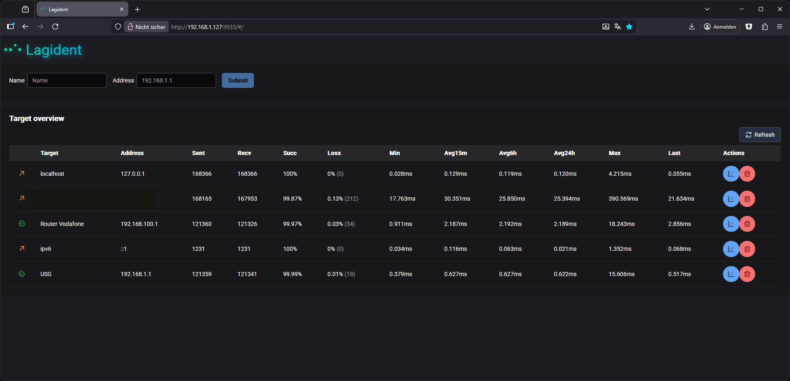
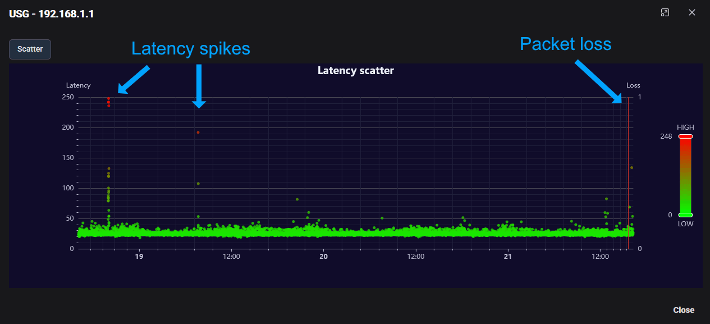
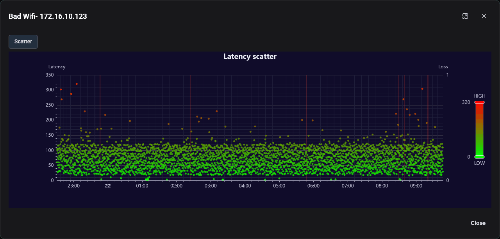

# Lagident


Lagident pings targets and collects information about response time and packet loss. The results are displayed through a scatter chart, which will (hopefully) help you identify anomalies across your network.

Lagident pings each target every **15** seconds.

This project was highly inspired by [Meshping](https://github.com/Svedrin/meshping). However, Meshping has more features.

## Web interface

Lagident has a simple web interface, where you can add new targets to ping.



Lagident will keep 3 days of data (~17280 measurements per target) and will display all points in a scatter chart.
You can use the chart to identify latency spikes or packet loss.


For example the chart for a poor quality Wifi connection can look like in the
following example.
As you can see the measured latency is all over the place from 5ms to 100ms most of the time and spikes to 300ms.
This connection is also suffering from packet loss. (0.33%)

Poor quality connections like this can be a pain for online gaming.


## Motivation
Meshping does not store any information about packet loss. Unfortunately, I had to deal with strange packet loss issues on my desktop PC. Additionally, I wanted to embed an Angular application into Go for a long time, so I thought this was a cool project to do.

## Features
 - Graphs displaying latencies and packet loss
 - Mobile-friendly
 - Add and remove targets on the fly
 - Simple Docker-based setup
 - IPv6 support

### Cons
Lagident is not a full-fledged monitoring solution. It is more like a stopwatch. All it does is send ping requests to targets and document the response time and packet loss. That's it. You cannot do anything else.

If you are looking for a comprehensive monitoring solution that can do more, you may want to take a look at [openITCOCKPIT](https://github.com/openITCOCKPIT/openITCOCKPIT).

## Start in Production Mode

To start Lagident in production mode, run:
```sh
docker compose up
```
This will build Lagident and start it together with
its database. Access Lagident on http://localhost:9933.

### Standalone with sqlite

First you should create a new volume to store the sqlite database file.
```
docker volume create lagident-sqlite-data
```

Now you can start the Lagident container:
```
docker run --rm \
 -p 9933:8080 \
 -e DB_TYPE=sqlite \
 -e PROFILE=prod \
 -v lagident-sqlite-data:/data \
 --name=lagident \
 nook24/lagident:latest
```

### Docker Compose with sqlite
```
docker compose -f docker-compose-sqlite.yml up
```

## Configuration

Lagident can be configured using environment variables. The following environment variables are available:

- `DB_TYPE`: The type of database to use (`mysql` or `sqlite`).
- `DB_HOST`: The database host (for MySQL).
- `DB_PORT`: The database port (for MySQL).
- `DB_USER`: The database user (for MySQL).
- `DB_PASS`: The database password (for MySQL).
- `DB_NAME`: The database name.
- `PROFILE`: The application profile (`dev` or `prod`).

## Support for x64 and arm64

The official Docker images of Lagident are available for `amd64` and `arm64` so you can
setup Lagident on your Desktop PC, Apple silicon or a SoC like the Raspberry Pi 4 or newer.


# Start in development mode

## Environment setup

You need to have [Go](https://go.dev/),
[Node.js](https://nodejs.org/) and
[Docker](https://www.docker.com/)
installed on your computer.

Verify the tools by running the following commands:

```sh
go version
npm --version
docker --version
```


In the project directory run the command (you might
need to prepend it with `sudo` depending on your setup):
```sh
docker compose -f docker-compose-dev.yml up
```

This starts a local MySQL database on `localhost:3306`.
The database will be populated with test records from
the [init-mysqldb.sql](init-mysqldb.sql) file for MySQL
and in the `InitializeSQLiteDB` function for SQLite.

Navigate to the `server` folder and start the back end:

```sh
cd server
go run server.go
```
The back end will serve on http://localhost:8080.

Navigate to the `webapp` folder, install dependencies,
and start the front end development server by running:

```sh
cd webapp
npm install
npm start
```
The application will be available on http://localhost:3000.


## Connect to database
```
mysql --defaults-file=./mysql.cnf
```

## Acknowledgements

- This project was kickstarted using the [goxygen](https://github.com/shpota/goxygen) project, thanks a lot.
- Also thanks to my brother wo created [meshping](https://github.com/Svedrin/meshping), in the first place.

## Naming
The name is a combination of [Lag](https://en.wikipedia.org/wiki/Lag_(video_games)) and [identify](https://en.wiktionary.org/wiki/identify) == `Lagident`.

## Release new version

1. Increase version number in [VERSION](VERSION) file.
2. Login to Docker Registry using `docker login`
3. Run `./build_release`

## License

This project is licensed under the MIT License. See the [LICENSE](LICENSE) file for more information.
